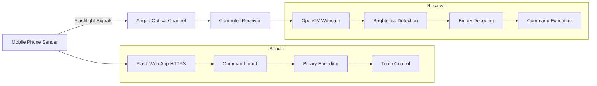
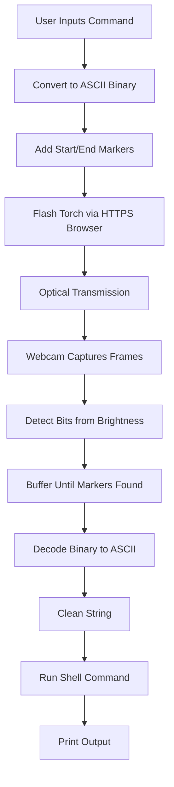

# Flash_C2

## Overview

Flash_C2 is an innovative airgapped Command and Control (C2) system that enables the transmission of commands from a mobile phone to a computer using the phone's flashlight as an optical signaling mechanism. This setup allows for unidirectional communication across an airgap, where traditional network connections are absent or prohibited. The system encodes commands into binary signals (1 for light on, 0 for light off), which are flashed by the phone and detected by the computer's webcam. The receiver decodes the binary data, executes the command on the host system, and outputs the results.

This project is ideal for red teaming, penetration testing, or secure environments where physical separation (airgapping) is enforced, but optical data exfiltration or command injection is feasible. Note: Use responsibly and ensure compliance with legal and ethical guidelines.

## Key Features

- **Airgapped Communication**: No network required; relies solely on optical signals via flashlight and webcam.
- **Binary Encoding**: Commands are converted to ASCII binary with start (11111110) and end (00000000) markers for reliable transmission.
- **Command Execution**: Receiver decodes and runs shell commands on the target machine, capturing and printing output.
- **Cross-Platform Potential**: Sender runs in a browser on mobile devices supporting torch API (e.g., Android Chrome); receiver uses OpenCV on Python-compatible systems.
- **Customizable Parameters**: Bit duration (0.5 seconds default), brightness threshold (100 default) for signal detection.
- **Error Handling**: Basic noise tolerance through markers; receiver ignores data until start marker is detected.

## How It Works

### High-Level Flow
1. **Sender (Mobile Phone)**:
   - User inputs a command (e.g., "whoami") via a web interface.
   - Command is converted to ASCII binary.
   - Start marker ("11111110") and end marker ("00000000") are added.
   - Browser accesses the phone's rear camera torch and flashes it: ON for '1' (bright), OFF for '0' (dark), with a fixed bit duration (500ms).

2. **Receiver (Computer)**:
   - Webcam captures video frames in real-time.
   - Converts frames to grayscale and calculates average brightness.
   - Thresholds brightness to detect '1' (above threshold) or '0' (below).
   - Buffers bits until start marker is found, then collects until end marker.
   - Decodes binary to ASCII, cleans the string (lowercase, remove spaces/zeros/backticks/etc.), and executes as a shell command using `subprocess`.
   - Prints the decoded command and execution output.
   - Loops indefinitely for multiple transmissions.

### Technical Details
- **Binary Transmission**:
  - Each character in the command is encoded as an 8-bit binary string.
  - Example: "whoami" -> Binary (with markers).
- **Detection**:
  - Brightness threshold: 100 (adjustable; depends on ambient light and distance).
  - Bit sampling rate: Every 0.5 seconds (sync with sender's 500ms).
- **Cleanup in Receiver**:
  - Decoded string is processed: `.lower().replace(" ","").replace("0","").replace("`","").replace("±","").replace("¶","")`
  - This handles potential transmission noise or artifacts.
- **Limitations**:
  - Unidirectional (phone to computer only).
  - Sensitive to ambient light, distance, and movement; best in dark environments with phone flashlight directly facing webcam.
  - No encryption; commands are sent in plaintext binary.
  - Potential for bit errors if timing desyncs or light interference occurs.
- **Security Requirement for Flashlight Access**: To access the phone's flashlight (torch) via the browser, the web interface must be served over HTTPS. Browsers like Chrome require a secure context for `getUserMedia` with torch capabilities. You will need to set up SSL certificates (e.g., self-signed for local testing) or use a tunneling service like ngrok to expose the Flask server over HTTPS.

### Diagrams

#### ASCII Art Diagrams

##### System Architecture
```
[Mobile Phone (Sender)]                  [Airgap (Optical)]                  [Computer (Receiver)]

+--------------------+                                                  +--------------------+
| Web Browser        |                                                  | Python Script      |
| - Flask App (HTTPS)|   Flashlight Signals (Binary: 1=ON, 0=OFF)    | - OpenCV Webcam    |
| - Input: Command   |  ------------------------------------------>   | - Detect Brightness|
| - Encode to Binary |                                                  | - Decode Binary    |
| - Control Torch    |                                                  | - Execute Command  |
+--------------------+                                                  +--------------------+

Example Signal Waveform (Time vs Light):
Light ON  (1):  *****
Light OFF (0): _____

Start Marker: 11111110 -> ***** **_____
Message Bits: [Binary of Command]
End Marker:   00000000 -> ________
```

##### Data Flow
```
User Input (e.g., "whoami") 
  ↓
ASCII to Binary (e.g., 'w' = 01110111)
  ↓
Add Markers: 11111110 + Binary + 00000000
  ↓
Flash Torch in Sequence (500ms per bit)
  ↓ (Optical Transmission via HTTPS-Served Interface)
Webcam Captures Frames → Calculate Avg Brightness → Bit (1/0)
  ↓
Buffer Bits → Detect Start/End → Extract Message Bits
  ↓
Binary to ASCII → Clean String → Run Shell Command
  ↓
Print Output (e.g., "shikykai")
```

#### GitHub Renderable Diagrams (Mermaid)

GitHub supports rendering Mermaid diagrams in Markdown. Below are Mermaid code blocks for visual diagrams. If viewing on GitHub, they will render as images.

##### System Architecture Diagram


##### Data Flow Diagram


If the Mermaid diagrams do not render, you can paste the code into a Mermaid renderer like mermaid.live to generate images and add them to the repo as PNGs (e.g., `system_architecture.png` and reference them in the README: ``).

## Requirements

### Sender
- Python 3.x (for running Flask server).
- Flask library (`pip install flask`).
- Mobile device with:
  - Browser supporting `navigator.mediaDevices.getUserMedia` and torch control (e.g., Chrome on Android).
  - Rear camera with flashlight.
- HTTPS setup: SSL certificate or ngrok for secure access to flashlight.


### Receiver
- Python 3.x.
- Libraries: OpenCV (`pip install opencv-python`), NumPy (`pip install numpy`).
- Webcam (built-in or external).
- Access to run shell commands (potential security risk; run in isolated environment).


## Demo

https://github.com/user-attachments/assets/2e16ed32-e822-47fc-bbe6-90148b917150

## Installation

1. Clone the repository:
   ```
   git clone https://github.com/shiky8/Flash_C2.git
   cd Flash_C2
   ```

2. Install dependencies:
   ```
   pip install flask opencv-python numpy
   ```
   or
   ```
   python3 -m  pip install -r requirements.txt
   ```

4. Ensure files are present:
   - `sender.py`: Flask app for sender interface.
   - `flash_c2.py`: Receiver script.
   - (Optional) `outout.txt`: Sample logs for reference.

## Usage

### Setting Up HTTPS for Sender
- **Option 1: SSL Certificates**:
  - Generate self-signed certs: `openssl req -x509 -nodes -days 365 -newkey rsa:2048 -keyout key.pem -out cert.pem`.
  - Run Flask with SSL: In `sender.py`, change `app.run(host="0.0.0.0", port=5000, debug=True)` to `app.run(host="0.0.0.0", port=5000, debug=True, ssl_context=('cert.pem', 'key.pem'))`.
  - Access via `https://<server-ip>:5000` (accept self-signed cert warning).

- **Option 2: Ngrok**:
  - Install ngrok: Download from ngrok.com and run `ngrok http 5000`.
  - Ngrok provides an HTTPS URL (e.g., `https://<random>.ngrok.io`).
  - Start Flask normally, then access the ngrok URL on the phone.

### Running the Sender
1. Start the Flask server (with HTTPS as above).
2. On the mobile phone:
   - Open the HTTPS URL in browser.
   - Grant camera permissions (for torch access).
   - Enter a command (e.g., "whoami") and click "Send".
   - Point the flashlight at the computer's webcam.
   - Status updates to show encoding and transmission.

### Running the Receiver
1. On the airgapped computer:
   ```
   python flash_c2.py
   ```
   - Script opens webcam and listens for signals.
   - Point webcam at phone's flashlight.
   - It prints incoming bits in real-time.
   - When end marker detected, decodes and executes command.

2. Stop: Press Ctrl+C.

### Examples
From sample logs (`outout.txt`):

1. **Command: "whoami"**
   - Received Bits (partial): ...11111110 0101011101101000011011110110000101101101011010010010000000100000001 00000000
   - Decoded: "whoami"
   - Output: "shikykai"

2. **Command: "id"**
   - Received Bits (partial): ...11111110 010010010110010000100000001 00000000
   - Decoded: "id"
   - Output: "uid=1000(shikykai) gid=1000(shikykai) groups=1000(shikykai),20(dialout),..."

3. **Command: "ls"**
   - Received Bits (partial): ...11111110 010011000111001100100000001 00000000
   - Decoded: "ls"
   - Output: "app.py\ncert.pem\ndecode.py\nfinel\nflash_message.py\n..."

## Troubleshooting
- **No Flashlight Access**: Ensure HTTPS is used; browsers block torch on HTTP.
- **Ngrok Issues**: Check ngrok status and ensure no firewall blocks.
- **No Detection**: Adjust THRESHOLD in `flash_c2.py` based on lighting. Ensure minimal ambient light.
- **Timing Issues**: Match BIT_DURATION between sender (500ms) and receiver (0.5s).
- **Torch Not Supported**: Check browser/device compatibility; test on Android Chrome.
- **Noise in Decoding**: Improve cleanup logic if garbled characters appear.
- **Security**: Receiver executes arbitrary commands—run in VM or sandbox.

## Future Improvements
- Bidirectional communication (e.g., computer screen flashing back to phone camera).
- Error correction (e.g., Hamming codes).
- Encryption for commands.
- Faster bit rates or adaptive thresholding.

## License
MIT License. See LICENSE file for details.

## Acknowledgments
- Built with OpenCV for computer vision and Flask for web interface.
- Inspired by optical covert channels in security research.
